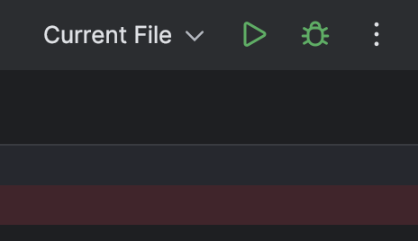
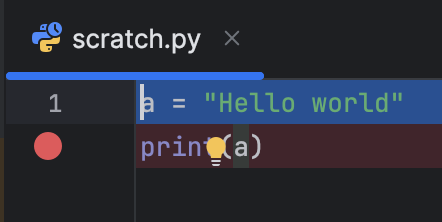
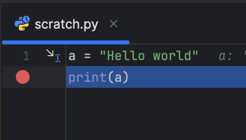
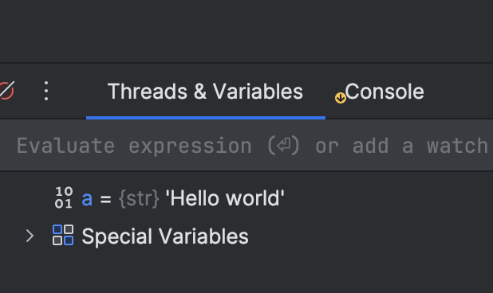
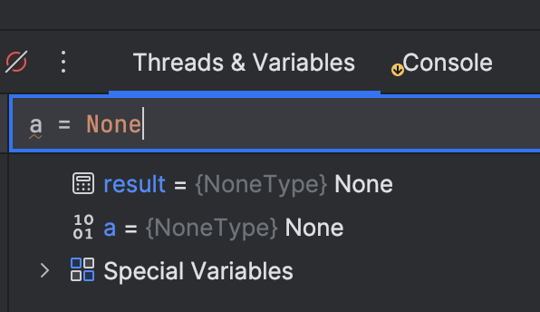
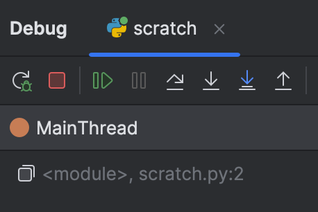
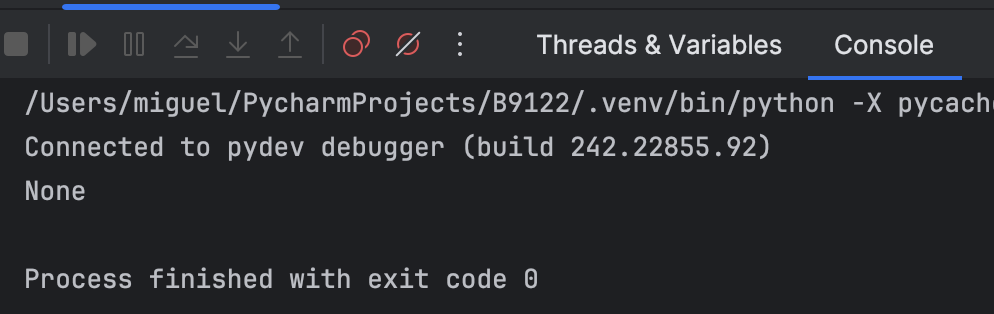

# Installing PyCharm

After discussing with students in Office Hours, I have decided to support only one IDE (Integrated Development Environment), PyCharm. We already have a range of prior experience and operating systems, so supporting different IDEs could add additional and unnecessary complexity. I ask that all students install PyCharm (unlike what I wrote in lecture 1).

## installation steps

1. Step 1: Please download PyCharm from [here](https://www.jetbrains.com/pycharm/download/) and run it (accept terms and conditions and stay with all default settings).

2. Step 2: Optionally, you can get a license for education from [here](https://www.jetbrains.com/community/education/#students/), or you can wait for the end of the 30-day free trial.

3. Step 3: Open PyCharm, open a new project (call it "B9122", for example).

4. Step 4: On MacOS, PyCharm automatically detects installed Python.

_On Windows_, you have to give it the path to Anaconda Python (similar to what you got from connecting Git Bash to Anaconda Python).

To do so, start an **Anaconda Command Shell**, and type:

``` python
where python
```

Copy the path you get from there.

Open PyCharm. You should see "Configure Python Interpreter" at the top right, then on "Add New Interpreter", then on "Add Local Interpreter". In Environment, "New" is selected, but click on "Existing". Click on the three dots at the right. Paste the path you got from Anaconda Command Shell. Click OK, then OK.

You succeeded if you no longer see "Configure Python Interpreter".

## Steps to create, run, and debug a file

Click on File > New Scratch File > Python file, and type:

``` python
a = "Hello world"
print(a)
```

At the top right, click on the button with the Play symbol to run it:



Under the file name "scratch.py", you have line numbers for the lines you typed; click on the number 2. A red circle should appear and indicates a breakpoint: Python will execute code and stop at this point:



Click on the bug symbol next to the Play button:


The first line gets highlighted and execution stopped at your breakpoint. You are now inside the debugger:



In the bottom left of the program, there is a window called "Threads & Variables":



Click on the box that says "Evaluate expression", then type and run this code: `a = None`.



Hit the button "Play" at the left, which means "Continue execution":



Switch to the console tab, to the right of "Threads & Variables":



You should now see that the Python program printed "None" instead of "Hello world".

That is: you changed a variable "on-the-fly", from inside the debugger, and concluded this part of the assignment.

